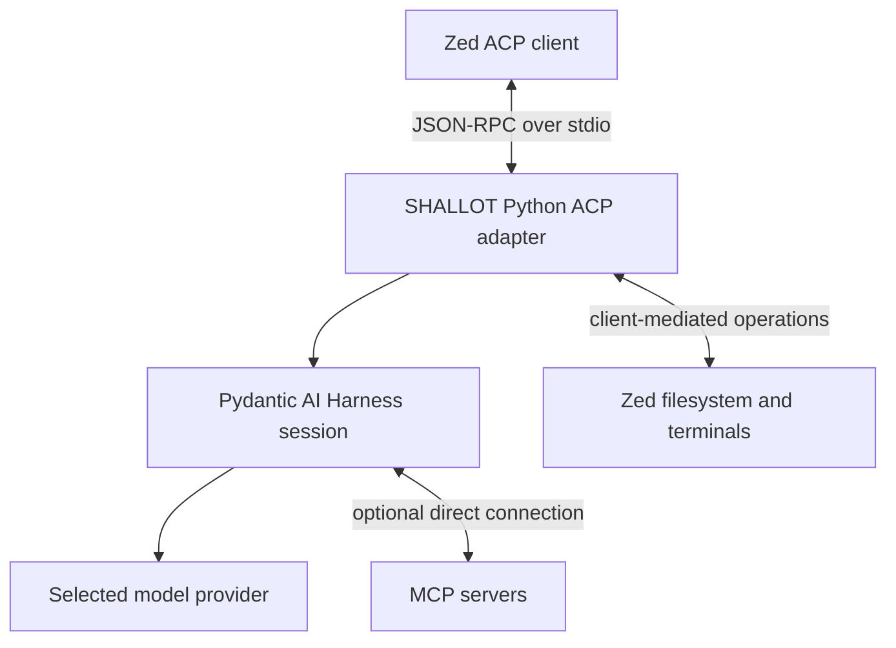

# ACP exposure and optional model providers for SHALLOT

**Research date:** 2026-08-26  
**Scope:** Exposing a standalone Python agent harness to Zed through Agent Client Protocol (ACP), and evaluating GreenPT, Berget AI, and Mistral as optional model providers near or below €20/month.  
**Method:** Primary official specifications, documentation, package metadata, policies, and pricing pages. Package versions and commercial terms are point-in-time facts and must be rechecked before deployment or purchase.

## Claim labels

- **Verified** — stated by a cited first-party source or official package metadata.
- **Assessment** — engineering or purchasing judgment derived from verified facts.
- **Unknown** — not established by the reviewed official material.

## Executive decision

**Assessment:** Use the experimental ACP adapter in **Pydantic AI Harness**, pinned to an exact compatible dependency set, and expose it as a newline-delimited JSON-RPC subprocess over standard input/output. This is the thinnest SHALLOT path because the proposed standalone harness already favors Pydantic, while the adapter provides ACP lifecycle, stream, cancellation, permission, filesystem, and terminal mappings without a second orchestration runtime.

Use **stable ACP v1** as the production contract. ACP v2 was published as a **draft** on 2026-07-20; its features should remain behind protocol negotiation and an explicit feature flag until finalized. The v2 announcement says the draft may change, retains v1 compatibility, and asks implementers to experiment rather than replace stable implementations ([ACP v2 draft announcement](https://agentclientprotocol.com/announcements/acp-v2-draft.md)).

Pin, at the researched date:

```text
pydantic-ai-harness[acp]==0.25.0
agent-client-protocol>=0.11,<0.12
```

**Verified:** `pydantic-ai-harness` 0.25.0 constrains its ACP extra to `agent-client-protocol>=0.11,<0.12`, while the standalone Python ACP SDK has reached 0.12.1. The older SDK constraint is therefore intentional, not an invitation to install the newest SDK independently ([Pydantic AI Harness package metadata](https://pypi.org/pypi/pydantic-ai-harness/json), [Python ACP SDK package metadata](https://pypi.org/pypi/agent-client-protocol/json)).

**Assessment:** Provider order for a constrained optional setup:

1. **GreenPT API-only** — clearly compatible with a prepaid sub-€20 cap and European inference claims, subject to model capability tests and clarification of France/Finland policy wording.
2. **Mistral API** — mature official API/SDK path, free or capped PAYG can fit; use `api.eu.mistral.ai` when EU/EFTA inference location is required and accept its 10% surcharge and feature limits.
3. **Berget AI** — technically suitable and Swedish/EEA-oriented, but not an ongoing ≤€20/month option: the post-trial Starter plan is €25/month excluding VAT.

## 1. ACP protocol architecture and status

### 1.1 Boundary and transport

**Verified:** ACP is the protocol between a code editor/client and a coding agent. MCP is complementary: it connects an agent or application to external tools and data. In the normal local architecture, the editor launches an agent subprocess, then the two peers exchange JSON-RPC messages over standard input/output. One connection can carry concurrent sessions and bidirectional requests and notifications ([ACP architecture](https://agentclientprotocol.com/get-started/architecture.md)).



**Verified:** The standard I/O transport uses newline-delimited UTF-8 JSON-RPC. Standard output must contain only ACP messages; diagnostics belong on standard error. The transport is local and process-oriented; transport encryption is not defined because ACP itself does not send the subprocess over a network ([ACP transports](https://agentclientprotocol.com/protocol/v1/transports.md)).

**Assessment:** Keep logging, tracing, model debug output, and accidental `print()` calls off stdout. One non-JSON line can corrupt the Zed connection.

### 1.2 Stable v1 versus draft v2

**Verified:** v1 initializes a connection, creates or restores sessions, and treats `session/prompt` as one complete turn. The agent streams interim updates and eventually returns a stop reason. ACP v2 proposes prompt acknowledgement followed by background work, explicit session state, uniform identifiers/upserts/chunks, and revised diff and permission semantics. It remains a draft and may change ([v1 prompt turn](https://agentclientprotocol.com/protocol/v1/prompt-turn.md), [ACP v2 draft announcement](https://agentclientprotocol.com/announcements/acp-v2-draft.md)).

**Assessment:** Implement v1 completely. Negotiate protocol versions during initialization. Do not expose v2-only behavior unless both peers negotiate it and SHALLOT enables it deliberately.

## 2. Connection and session lifecycle

### 2.1 Initialization

**Verified:** The client starts with `initialize`, declaring its supported protocol version and client capabilities. The agent responds with its negotiated protocol version, agent capabilities, and available authentication methods. Major protocol versions provide the compatibility boundary ([ACP initialization](https://agentclientprotocol.com/protocol/v1/initialization.md)).

### 2.2 Baseline lifecycle

**Verified:** A baseline ACP agent supports:

1. `initialize`
2. `session/new`
3. one or more `session/prompt` turns
4. streamed `session/update` notifications during each turn
5. `session/cancel` when requested

`session/new` carries an authoritative `cwd`, optional additional roots, and MCP server configurations. The `cwd` controls the session even if the subprocess was launched from a different directory ([ACP session setup](https://agentclientprotocol.com/protocol/v1/session-setup.md), [ACP prompt turn](https://agentclientprotocol.com/protocol/v1/prompt-turn.md)).

**Verified:** Persistence-related methods are capability-dependent:

- `session/load` restores a prior session and replays its history to the client.
- `session/resume` restores agent state without replaying previous messages.
- `session/close` releases session resources.

The peers must negotiate support rather than assume these methods exist ([ACP session setup](https://agentclientprotocol.com/protocol/v1/session-setup.md)).

**Assessment:** Give every ACP session isolated harness state. Key persistent state by an opaque session ID, not by prompt text or only by directory. Canonicalize and validate `cwd` and every additional root before constructing tools.

## 3. Streaming, tools, permissions, filesystem, and terminal

### 3.1 Streaming

**Verified:** During a v1 turn, the agent emits `session/update` notifications. Updates can carry assistant text chunks, reasoning/thought chunks when supported, plans, tool-call starts and updates, and usage information. The final `session/prompt` response contains the turn's `stopReason` ([ACP prompt turn](https://agentclientprotocol.com/protocol/v1/prompt-turn.md)).

**Assessment:** Translate native harness events as they arrive. Do not accumulate the full answer before emitting text. Preserve stable tool-call IDs so Zed can update one UI item rather than render duplicates.

### 3.2 Tool ownership and permission flow

**Verified:** The **agent** decides and executes tool calls. It reports tool-call state to the client and can ask the client for authorization through `session/request_permission`. Permission options express choices such as allow or reject once or always. The client can present these to the user or decide automatically according to its policy ([ACP tool calls](https://agentclientprotocol.com/protocol/v1/tool-calls.md)).

**Assessment:** ACP permission UX is not a security sandbox. An “allow always” response is only a policy decision. SHALLOT must independently enforce:

- canonical workspace and additional-root boundaries;
- no traversal or symlink escape;
- a small command allowlist or explicit high-risk command denial policy;
- no inherited secrets unless required;
- redaction of secrets from prompts, tool output, logs, and traces;
- output, runtime, and process-count limits;
- cancellation that terminates child processes;
- provider budget and token ceilings.

### 3.3 Client-mediated filesystem

**Verified:** ACP clients may expose filesystem requests to agents. `fs/read_text_file` lets an agent read the editor's current content, including unsaved buffers; `fs/write_text_file` lets it write through the client. These are negotiated client capabilities, not guaranteed local OS primitives ([ACP filesystem](https://agentclientprotocol.com/protocol/v1/file-system.md)).

**Assessment:** Prefer client-mediated file access where practical because it respects Zed's current buffer state. Fall back to a rooted local `FileSystem` tool only when the client does not advertise support. Treat binary files and large-file behavior separately; the v1 methods cited here are text-oriented.

### 3.4 Client-mediated terminals

**Verified:** The terminal API supports creation, output retrieval, waiting for exit, killing, and releasing. Captured output is bounded. Terminal metadata can be attached to tool-call updates so the client can embed the terminal experience ([ACP terminals](https://agentclientprotocol.com/protocol/v1/terminals.md)).

**Assessment:** Always release terminal handles. On turn cancellation or session close, kill active child processes before releasing handles. Do not equate captured output with an unrestricted interactive shell.

## 4. MCP forwarding

**Verified:** `session/new` can provide MCP server configurations. An ACP agent must support standard-I/O MCP server configurations; HTTP and SSE support depend on negotiated capabilities. The agent, not Zed, normally makes the MCP connection. A client can also offer its own MCP proxy/configuration through ACP ([ACP session setup](https://agentclientprotocol.com/protocol/v1/session-setup.md), [Zed external agents](https://zed.dev/docs/ai/external-agents.md)).

**Verified:** Zed-configured MCP servers can be forwarded to an external ACP agent, but the external agent remains responsible for using the received configurations ([Zed external agents](https://zed.dev/docs/ai/external-agents.md)).

**Verified:** Pydantic AI Harness exposes incoming MCP configurations to `session_config`, but its experimental ACP adapter does **not** connect to them automatically. If `session_config` does not consume them, the adapter rejects them ([Pydantic AI Harness ACP](https://pydantic.dev/docs/ai/harness/acp/)).

**Assessment:** Phase 1 should support no MCP or an explicit small allowlist. Phase 2 can translate accepted stdio MCP entries into Pydantic toolsets. Never launch arbitrary forwarded executables merely because Zed supplied them; validate executable paths, arguments, environment, transport, and server identity.

## 5. Authentication

### 5.1 ACP-side authentication

**Verified:** During initialization, the agent advertises authentication methods. If authentication is needed, the client invokes `authenticate` with a selected method. Authentication is capability-driven and agent-specific rather than a universal ACP bearer-token scheme ([ACP authentication](https://agentclientprotocol.com/protocol/v1/authentication.md), [ACP initialization](https://agentclientprotocol.com/protocol/v1/initialization.md)).

### 5.2 Provider credentials

**Verified:** Zed treats an external agent as its own runtime. The external agent owns its model provider, credentials, tools, native configuration, legal terms, retention behavior, and provider bill. Zed does not charge for external-agent model usage ([Zed external agents](https://zed.dev/docs/ai/external-agents.md)).

**Assessment:** Do not check provider API keys into Zed settings or the repository. Use an OS keychain-backed launcher, a private runtime environment, or a wrapper executable that injects only the selected provider credential. macOS GUI applications do not reliably inherit interactive shell startup variables, so test the actual Zed-launched environment.

## 6. Official ACP libraries and runtime support

### 6.1 Official protocol SDKs

| Language | Official status as of research date | Notes |
|---|---|---|
| Rust | **Verified:** official; 1.0 SDK announced 2026-06-25 | Suitable for clients and agents. [Rust library](https://agentclientprotocol.com/libraries/rust.md), [1.0 announcement](https://agentclientprotocol.com/announcements/sdk-1-0-releases.md) |
| TypeScript | **Verified:** official; 1.0 SDK announced 2026-06-25 | Suitable for Node-based clients and agents. [TypeScript library](https://agentclientprotocol.com/libraries/typescript.md), [1.0 announcement](https://agentclientprotocol.com/announcements/sdk-1-0-releases.md) |
| Python | **Verified:** official package, version 0.12.1; supports Python 3.10–3.14 | Pre-1.0 versioning means tighter pinning is prudent. [Python library](https://agentclientprotocol.com/libraries/python.md), [PyPI metadata](https://pypi.org/pypi/agent-client-protocol/json) |
| Java | **Verified:** official library documented | [Java library](https://agentclientprotocol.com/libraries/java.md) |
| Kotlin/JVM | **Verified:** official library documented | [Kotlin library](https://agentclientprotocol.com/libraries/kotlin.md) |
| Other languages | **Verified:** community implementations are listed separately | Do not treat community status as official support. [Community libraries](https://agentclientprotocol.com/libraries/community.md) |

**Assessment:** A raw Python SDK server is viable and grants maximum control, but SHALLOT would need to map every harness event, lifecycle method, tool status, permission request, cancellation path, and optional persistence feature itself. That is more code and protocol risk than the Pydantic adapter.

### 6.2 Agent-runtime ACP support

| Runtime | Native ACP support | Assessment for SHALLOT |
|---|---|---|
| Pydantic AI Harness | **Verified:** official but experimental `pydantic_ai_harness.experimental.acp`; `run_acp_stdio_sync` entry point | **Preferred.** Thinnest fit with the chosen Python/Pydantic direction. Exact pins and adapter-level tests required. [Official ACP adapter docs](https://pydantic.dev/docs/ai/harness/acp/) |
| LangGraph alone | **Verified/clarification:** orchestration foundation, not the ACP server integration evaluated here | No reason to introduce it solely for ACP. |
| Deep Agents | **Verified:** official `deepagents-acp` package; 0.0.10, Python ≥3.11; wraps an agent with `AgentServerACP(agent)` | Viable if SHALLOT adopts Deep Agents. Larger framework/runtime surface than needed now. [Deep Agents ACP docs](https://docs.langchain.com/oss/python/deepagents/acp), [package metadata](https://pypi.org/pypi/deepagents-acp/json) |
| `dcode` | **Verified:** `dcode --acp` supplies a prebuilt Deep Agents filesystem/shell/MCP/subagent environment | Fast generic coding-agent option, but not the thinnest custom SHALLOT harness. [Deep Agents ACP docs](https://docs.langchain.com/oss/python/deepagents/acp) |
| Raw Python ACP SDK | **Verified:** official protocol implementation | Best only if experimental adapter constraints become blockers or SHALLOT needs precise unsupported protocol behavior. |

**Verified:** Deep Agents can switch models and can implement durable `session/load` when backed by a persistent LangGraph checkpointer ([Deep Agents ACP docs](https://docs.langchain.com/oss/python/deepagents/acp)).

**Unknown:** The reviewed official material does not establish a stability guarantee for the Pydantic experimental adapter. Its own documentation says experimental APIs may change or be removed without deprecation. Earlier Deep Agents package behavior is not a guarantee of current schema compatibility; its broad ACP dependency should be locked and integration-tested.

## 7. Zed custom external-agent configuration

**Verified:** Zed supports custom ACP agents from **Agent Settings → External Agents → Add Custom Agent** and via `agent_servers` settings. A custom server specifies `type`, `command`, `args`, and optional `env` ([Zed external agents](https://zed.dev/docs/ai/external-agents.md)).

A SHALLOT launcher can be configured as:

```json
{
  "agent_servers": {
    "shallot": {
      "type": "custom",
      "command": "/absolute/path/to/shallot-acp",
      "args": [],
      "env": {}
    }
  }
}
```

Or, during development:

```json
{
  "agent_servers": {
    "shallot-dev": {
      "type": "custom",
      "command": "uv",
      "args": [
        "run",
        "--project",
        "/absolute/path/to/yh-cybersec-prototype",
        "python",
        "-m",
        "shallot.acp_server"
      ],
      "env": {}
    }
  }
}
```

**Assessment:** An absolute installed launcher is less sensitive to GUI `PATH` and working-directory differences. Keep `env` empty of secrets where possible. A wrapper may fetch credentials from Keychain and then `exec` the pinned environment.

**Verified:** The external agent owns its model/runtime and does not automatically inherit Zed profiles or skills. Zed recommends its registry for commonly packaged agents. ACP diagnostics are available through `dev: open acp logs` ([Zed external agents](https://zed.dev/docs/ai/external-agents.md)).

## 8. Thinnest SHALLOT adapter

### 8.1 Proposed layers

```text
Zed
  ↕ ACP v1 / stdio
Pydantic AI Harness experimental ACP adapter
  ↕ AcpSessionConfig
existing SHALLOT agent + narrowly scoped toolsets
  ↕ OpenAIChatModel/OpenAIProvider
GreenPT, Berget AI, or Mistral Chat Completions endpoint
```

No separate HTTP daemon, WebSocket bridge, sidecar, LangGraph graph, custom JSON-RPC implementation, or editor extension is needed.

Minimal shape, adapted from the official Harness API:

```python
from pydantic_ai_harness import FileSystem, Shell
from pydantic_ai_harness.experimental.acp import (
    AcpSessionConfig,
    acp_filesystem,
    acp_terminal,
    run_acp_stdio_sync,
)


def session_config(session):
    filesystem = acp_filesystem(session) or FileSystem(root_dir=session.cwd).get_toolset()
    shell = acp_terminal(session) or Shell(cwd=session.cwd).get_toolset()
    return AcpSessionConfig(deps=None, toolsets=[filesystem, shell])


run_acp_stdio_sync(agent, session_config=session_config)
```

The final imports and signatures must be verified against the pinned release when implemented; this is architecture pseudocode, not committed production code.

**Verified adapter capabilities:** streamed text/reasoning, rich tool kinds and locations, filesystem/shell diffs, deferred approvals mapped to ACP permissions, per-workspace session configuration, cancellation, multi-turn history, close, optional persistence, model selection, optional client-mediated filesystem/terminal helpers, and access to incoming MCP configurations ([Pydantic AI Harness ACP](https://pydantic.dev/docs/ai/harness/acp/)).

**Verified limitations:** experimental API; MCP configurations are not automatically connected; the terminal helper returns captured output rather than a live terminal pane; overwrite diffs can under-represent a replacement; slash commands are absent; synchronous tools cannot be safely force-cancelled ([Pydantic AI Harness ACP](https://pydantic.dev/docs/ai/harness/acp/)).

### 8.2 Implementation gates

Before enabling the adapter for real work:

1. Lock both Harness and ACP SDK versions.
2. Add a subprocess smoke test: initialize → new → prompt → stream → close.
3. Test cancel during model streaming and during a long asynchronous tool.
4. Test permission deny, allow once, and remembered allow.
5. Test unsaved-buffer reads and rooted fallback filesystem behavior.
6. Test terminal kill/release and ensure no orphan process survives.
7. Reject roots outside policy and test traversal plus symlink escape.
8. Treat forwarded MCP servers as untrusted configuration.
9. Verify no log output reaches stdout.
10. Capability-test each provider/model for streaming, tool calls, JSON arguments, cancellation, and context limits.

## 9. Provider integration common path

**Verified:** Pydantic AI supports OpenAI-compatible Chat Completions providers through `OpenAIChatModel` with an `OpenAIProvider` carrying a custom base URL and API key ([Pydantic AI OpenAI models](https://ai.pydantic.dev/models/openai/)).

```python
from pydantic_ai.models.openai import OpenAIChatModel
from pydantic_ai.providers.openai import OpenAIProvider

model = OpenAIChatModel(
    model_name,
    provider=OpenAIProvider(base_url=base_url, api_key=api_key),
)
```

**Assessment:** Use this Chat Completions path for all three providers. Do not use Pydantic's default `openai:` Responses API assumptions for GreenPT or Berget unless their current official documentation explicitly adds Responses API support. “OpenAI compatible” also does not prove that every hosted model implements reliable tool calls or structured JSON; test the selected model.

## 10. Provider comparison

| Provider | API compatibility | Privacy and location | Price fit | Verdict |
|---|---|---|---|---|
| GreenPT | **Verified:** OpenAI-compatible Chat Completions, bearer key, SSE streaming, `/v1/models`; base `https://api.greenpt.ai/v1` | **Verified:** no training on API inputs; payloads processed in memory and not persistently stored; France-primary infrastructure with France/Finland inference wording | **Verified:** API-only free subscription + token PAYG; Starter €4.50/month incl. VAT; Pro €17.50/month incl. VAT | **Assessment:** Best clear ≤€20 option if prepaid usage is capped and policy wording is acceptable |
| Berget AI | **Verified:** OpenAI-compatible Chat Completions; base `https://api.berget.ai/v1`; model-dependent stream/tool/JSON support | **Verified:** zero retention claim for prompt/output; metadata retained; no training claim; Swedish/EEA infrastructure language | **Verified:** €5 trial credit; ongoing Starter €25/month excl. VAT | **Assessment:** Does not meet ongoing ≤€20 requirement |
| Mistral | **Verified:** OpenAI-structured Chat Completions; base `https://api.mistral.ai/v1`; official Python/TS SDKs; tools supported | **Verified:** API data not used for training, except Labs qualification; reviewed ZDR for eligible paid/stateless use; optional EU/EFTA inference endpoint | **Verified:** free mode and PAYG; displayed Pro $14.99/month; EU endpoint +10%; token prices in USD | **Assessment:** Good capped option; confirm Swedish checkout/VAT and regional feature/model availability |

## 11. GreenPT

### Verified facts

- Chat Completions is OpenAI-compatible at `https://api.greenpt.ai/v1`, authenticated with a bearer API key. Official examples expose `/v1/models` and SSE streaming ([GreenPT getting started](https://docs.greenpt.ai/get-started)).
- The model catalog includes open-weight coding and reasoning choices and changes over time. The official pricing page identifies retiring model IDs; runtime discovery is safer than hardcoding stale IDs ([GreenPT model cards](https://docs.greenpt.ai/model-cards), [GreenPT token pricing](https://docs.greenpt.ai/pricing)).
- Point-in-time token examples, per million tokens: `green-l` €0.25 input/€0.80 output; `green-r` €0.35/€0.95; `deepseek-v4-flash-0731` €0.14/€0.35; `glm-5.2` €1.10/€4.40; `kimi-k2.7-code` €0.77/€3.85; Mistral Small 3.2-hosted variant €0.20/€0.40. The token-pricing page says prices exclude applicable tax ([GreenPT token pricing](https://docs.greenpt.ai/pricing)).
- The API-only subscription is free with usage charged per token. Starter is €4.50/month including VAT and Pro €17.50/month including VAT ([GreenPT subscriptions](https://docs.greenpt.ai/subscriptions)). Purchased credits do not expire ([GreenPT credits](https://docs.greenpt.ai/credits)).
- GreenPT says API payloads are processed in memory, are not persistently stored, and are not used for training. Usage/token metadata is retained for billing and analytics, then anonymized or deleted within 12 months ([GreenPT privacy policy](https://docs.greenpt.ai/privacy/privacy-policy)).
- Official location pages describe primary infrastructure in France and inference in France/Finland. Search can involve Brave in the United States, but that statement applies to the separate `search.greenpt.ai` product rather than ordinary API inference ([GreenPT locations](https://docs.greenpt.ai/privacy/locations), [GreenPT privacy policy](https://docs.greenpt.ai/privacy/privacy-policy)).

### Unknowns and assessment

- **Unknown:** The privacy policy's “personal data exclusively in France” wording and the locations page's France/Finland inference statement are not fully reconciled. Obtain DPA confirmation before sensitive production use.
- **Unknown:** Contractual SLA, API-only support level, rate limits, independent security certifications, and exact tool-call conformance for each model were not established by the reviewed pages.
- **Assessment:** API-only prepaid credits can be held to €20. Pro itself fits below €20 including VAT, but Pro plus separate token use can exceed €20 unless spend is capped.
- **Assessment:** Query `/v1/models` and run a tool/JSON/streaming test before selecting a current coding model. Do not build around retiring Devstral/Qwen identifiers.

## 12. Berget AI

### Verified facts

- Berget exposes OpenAI-compatible Chat Completions at `https://api.berget.ai/v1` using bearer API keys ([Berget quickstart](https://docs.berget.ai/quickstart)).
- Streaming, tool use, and JSON support differ by model and are shown in the official capability matrix ([Berget model capabilities](https://docs.berget.ai/models/capabilities)).
- Point-in-time examples per million tokens: GPT-OSS 120B €0.20 input/€0.75 output; Mistral Small 3.2 €0.30/€0.30; GLM 4.7 €0.70/€2.50; Kimi K2.6 €0.75/€3.50 ([Berget model overview](https://docs.berget.ai/models/overview)).
- Trial is €0/month with €5 starting credit and requires a card. Continued API access requires Starter at €25/month excluding VAT ([Berget pricing](https://berget.ai/en/pricing)).
- Terms target entities/professional use rather than consumers ([Berget terms](https://berget.ai/en/terms)).
- Berget states it does not retain actual prompt/output content and does not train on customer inputs. It does retain operational metadata including status, timestamps, token counts, and user-defined parameters ([Berget terms](https://berget.ai/en/terms), [Berget DPA](https://berget.ai/en/dpa)).
- Public materials describe inference in Stockholm/Swedish infrastructure. The DPA more broadly says data centers are in the EEA and that customers can select a data center. Listed subprocessors include Swedish infrastructure/operators and Stripe ([Berget DPA](https://berget.ai/en/dpa), [Berget terms](https://berget.ai/en/terms)).
- Berget says it is working toward ISO 27001. That is not certification ([Berget terms](https://berget.ai/en/terms)).

### Unknowns and assessment

- **Unknown:** Exact operational-metadata retention duration, exact physical location of every serverless request, rate limits, and contractual SLA were not established.
- **Unknown:** Models marked `eval` or `maintenance` may not be production choices; availability must be checked at implementation time.
- **Assessment:** Berget fails the ongoing ≤€20/month requirement. Only the €5 trial fits. Starter is €25 before VAT; at 25% Swedish VAT its consumer arithmetic would be €31.25, although the terms target professional users.

## 13. Mistral

### Verified facts

- Mistral Chat Completions follows the OpenAI request structure and is exposed at `https://api.mistral.ai/v1`. Mistral also supplies official Python and TypeScript SDKs ([Mistral migration guides](https://docs.mistral.ai/resources/migration-guides)).
- Current models advertise function/tool calling where supported. Current generalist/coding options include Mistral Medium 3.5, Mistral Small 4, Mistral Large 3, Ministral 3 variants, Codestral, and hosted GLM 5.2. Old Devstral and Mistral Small 3.2 entries are deprecated/retired for new direct integrations ([Mistral models overview](https://docs.mistral.ai/models/overview)).
- Point-in-time USD prices per million tokens: Small 4 $0.15 input/$0.60 output; Medium 3.5 $1.50/$7.50; Large 3 $0.50/$1.50; Codestral $0.30/$0.90. Cached input is 10% of standard input price ([Mistral inference pricing](https://docs.mistral.ai/inference/pricing)).
- Free mode offers limited API access without a card. The public plan page displays Free with $10/month API credits and Pro at $14.99/month with $30/month API credits ([Mistral Studio activation](https://docs.mistral.ai/getting-started/quickstarts/studio/activate-and-generate-api-key), [Mistral pricing](https://mistral.ai/pricing/)).
- Organization spending limits can cap API use ([Mistral Studio activation](https://docs.mistral.ai/getting-started/quickstarts/studio/activate-and-generate-api-key)).
- Mistral states API data is not used for model training. Labs models are an exception whose data may be used regardless of opt-out ([Mistral privacy and data controls](https://docs.mistral.ai/admin/monitor-comply/privacy-data-controls)).
- Zero Data Retention is available only on paid plans after request and review, for supported stateless endpoints including Chat Completions. It excludes Agents, Batch/files, Conversations, Libraries, Vibe Work/Chat, and Labs ([Mistral ZDR](https://docs.mistral.ai/admin/monitor-comply/zero-data-retention)).
- EU regional inference uses `https://api.eu.mistral.ai`, costs 10% more, and commits inference processing to the EU/EFTA. The global endpoint makes no such location commitment. Control-plane metadata may remain outside the selected region. The regional endpoint omits stateful Agents, Batch, and Files; function calling is the supported regional tool mechanism, and model availability differs by region ([Mistral regional inference](https://docs.mistral.ai/inference/regional-inference)).

### Unknowns and assessment

- **Unknown:** The fetched public plan page did not establish a final Swedish EUR/VAT checkout amount. Pro's displayed $14.99 base figure appears compatible with €20, but checkout must be verified.
- **Unknown:** ZDR approval for SHALLOT cannot be assumed. Labs models do not meet the same no-training/ZDR expectations.
- **Assessment:** Free mode or PAYG with an organization spending cap can fit €20. Add the EU endpoint's 10% price premium when regional inference is required.
- **Assessment:** Use standard Chat Completions plus local ACP/harness tools. This avoids Mistral's stateful Agents feature, which is unavailable on the EU regional endpoint and excluded from ZDR.

## 14. Security, privacy, and purchasing checklist

Before selecting a provider or enabling Zed:

- [ ] Recheck current model IDs, deprecations, token prices, tax, and exchange rates.
- [ ] Set a hard provider spending limit at or below the desired monthly amount.
- [ ] Select a model proven to stream and call tools correctly through the provider's compatibility layer.
- [ ] Confirm prompt/output retention, metadata retention, training policy, subprocessors, and inference location in the applicable contract/DPA.
- [ ] For Mistral, avoid Labs, request ZDR if needed, and use the EU endpoint deliberately.
- [ ] For GreenPT, resolve the France-versus-France/Finland wording before sensitive use.
- [ ] Do not purchase Berget under a strict ongoing €20 ceiling.
- [ ] Keep credentials outside repository and Zed settings.
- [ ] Treat model output, forwarded MCP configuration, file paths, and shell arguments as untrusted.
- [ ] Preserve a local audit record of ACP permission decisions without logging secrets or full sensitive prompts.

## 15. Conclusion

**Assessment:** ACP v1 already provides the required editor/agent seam: subprocess startup, capability negotiation, concurrent session lifecycle, turn streaming, tool visualization, permission prompts, editor-aware filesystem operations, terminal control, and MCP configuration forwarding. Zed can launch that agent with a small `agent_servers` entry; no Zed extension is required.

For SHALLOT, the smallest responsible implementation is the pinned Pydantic AI Harness ACP adapter with one session factory, rooted tools, asynchronous cancellation, explicit MCP policy, and an OpenAI-compatible Chat Completions provider. Keep the raw Python SDK as an escape hatch if the experimental adapter's constraints become material. Deep Agents' maintained ACP package is real and capable, but adds an orchestration stack SHALLOT does not presently need.

GreenPT most clearly satisfies an optional ≤€20 European-provider budget. Mistral also fits through free/capped PAYG and offers an explicit EU inference endpoint, with caveats around the regional surcharge, control-plane location, ZDR approval, and checkout tax. Berget's privacy/location posture is attractive, but its mandatory €25 excluding-VAT Starter plan disqualifies it under the stated ongoing budget.

## Primary-source index

### ACP and Zed

- [ACP architecture](https://agentclientprotocol.com/get-started/architecture.md)
- [ACP v1 initialization](https://agentclientprotocol.com/protocol/v1/initialization.md)
- [ACP v1 session setup](https://agentclientprotocol.com/protocol/v1/session-setup.md)
- [ACP v1 prompt turn](https://agentclientprotocol.com/protocol/v1/prompt-turn.md)
- [ACP v1 tool calls](https://agentclientprotocol.com/protocol/v1/tool-calls.md)
- [ACP v1 authentication](https://agentclientprotocol.com/protocol/v1/authentication.md)
- [ACP v1 filesystem](https://agentclientprotocol.com/protocol/v1/file-system.md)
- [ACP v1 terminals](https://agentclientprotocol.com/protocol/v1/terminals.md)
- [ACP v1 transports](https://agentclientprotocol.com/protocol/v1/transports.md)
- [ACP v2 draft announcement](https://agentclientprotocol.com/announcements/acp-v2-draft.md)
- [Official Rust library](https://agentclientprotocol.com/libraries/rust.md)
- [Official TypeScript library](https://agentclientprotocol.com/libraries/typescript.md)
- [Official Python library](https://agentclientprotocol.com/libraries/python.md)
- [Official Java library](https://agentclientprotocol.com/libraries/java.md)
- [Official Kotlin library](https://agentclientprotocol.com/libraries/kotlin.md)
- [Official/community library distinction](https://agentclientprotocol.com/libraries/community.md)
- [Rust and TypeScript SDK 1.0 announcement](https://agentclientprotocol.com/announcements/sdk-1-0-releases.md)
- [Python ACP SDK quickstart](https://agentclientprotocol.github.io/python-sdk/quickstart/)
- [Python ACP SDK package metadata](https://pypi.org/pypi/agent-client-protocol/json)
- [Zed external agents](https://zed.dev/docs/ai/external-agents.md)

### Harnesses

- [Pydantic AI Harness ACP adapter](https://pydantic.dev/docs/ai/harness/acp/)
- [Pydantic AI Harness package metadata](https://pypi.org/pypi/pydantic-ai-harness/json)
- [Pydantic OpenAI-compatible model configuration](https://ai.pydantic.dev/models/openai/)
- [Deep Agents ACP integration](https://docs.langchain.com/oss/python/deepagents/acp)
- [Deep Agents ACP package metadata](https://pypi.org/pypi/deepagents-acp/json)

### GreenPT

- [Getting started/API](https://docs.greenpt.ai/get-started)
- [Subscriptions](https://docs.greenpt.ai/subscriptions)
- [Credits](https://docs.greenpt.ai/credits)
- [Token pricing](https://docs.greenpt.ai/pricing)
- [Model cards](https://docs.greenpt.ai/model-cards)
- [Privacy policy](https://docs.greenpt.ai/privacy/privacy-policy)
- [Locations](https://docs.greenpt.ai/privacy/locations)

### Berget AI

- [Quickstart/API](https://docs.berget.ai/quickstart)
- [Model overview and token pricing](https://docs.berget.ai/models/overview)
- [Model capability matrix](https://docs.berget.ai/models/capabilities)
- [Plans](https://berget.ai/en/pricing)
- [Terms](https://berget.ai/en/terms)
- [DPA](https://berget.ai/en/dpa)

### Mistral

- [OpenAI migration and API compatibility](https://docs.mistral.ai/resources/migration-guides)
- [Models overview](https://docs.mistral.ai/models/overview)
- [Inference pricing](https://docs.mistral.ai/inference/pricing)
- [Studio activation and free API access](https://docs.mistral.ai/getting-started/quickstarts/studio/activate-and-generate-api-key)
- [Plan pricing](https://mistral.ai/pricing/)
- [Privacy and data controls](https://docs.mistral.ai/admin/monitor-comply/privacy-data-controls)
- [Zero Data Retention](https://docs.mistral.ai/admin/monitor-comply/zero-data-retention)
- [Regional inference](https://docs.mistral.ai/inference/regional-inference)
